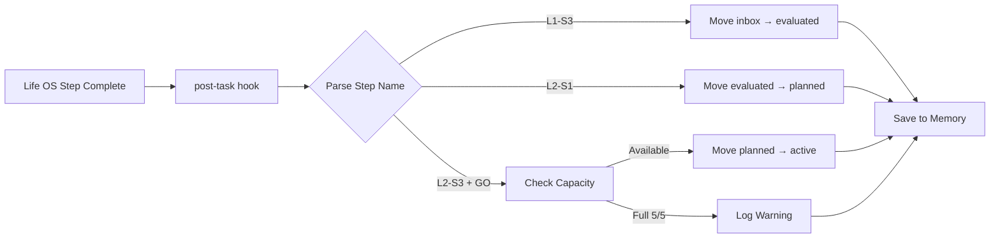

# Life OS Post-Task Hooks Configuration Guide

**Version:** 1.0
**Last Updated:** 2026-02-06
**Purpose:** Automate idea lifecycle transitions using Claude Flow V3 hooks system

---

## Table of Contents

1. [Overview](#overview)
2. [System Requirements](#system-requirements)
3. [Hook Architecture](#hook-architecture)
4. [Configuration Steps](#configuration-steps)
5. [Trigger Conditions](#trigger-conditions)
6. [Action Scripts](#action-scripts)
7. [Memory Integration](#memory-integration)
8. [Validation & Error Handling](#validation--error-handling)
9. [Testing Guide](#testing-guide)
10. [Troubleshooting](#troubleshooting)

---

## Overview

### What This System Does

The Life OS hooks system automatically moves idea files through their lifecycle stages when workflow steps complete:

```
L1-S3 Complete → inbox/       → evaluated/
L2-S1 Complete → evaluated/   → planned/
L2-S3 Complete → planned/     → active/ (if GO decision + capacity available)
```

### Benefits

- **Zero manual file management** - Files move automatically
- **Audit trail** - Every transition logged to global memory
- **Capacity enforcement** - Cannot activate if 5/5 projects active
- **Error resilience** - Graceful handling of missing files, full capacity
- **Cross-session persistence** - Works across multiple Claude sessions

---

## System Requirements

### Prerequisites

| Component | Version | Status Check |
|-----------|---------|--------------|
| **Claude Flow CLI** | v3.0.0-alpha.12+ | `npx claude-flow@v3alpha --version` |
| **Node.js** | v20.0.0+ | `node --version` |
| **Daemon** | Running | `npx claude-flow@v3alpha daemon status` |
| **Memory Backend** | hybrid or ruvector | `npx claude-flow@v3alpha memory status` |
| **Background Workers** | 5+ enabled | `npx claude-flow@v3alpha daemon status` |

### Verify System Health

```powershell
# Run health check
npx claude-flow@v3alpha doctor --fix

# Start daemon if needed
npx claude-flow@v3alpha daemon start

# Enable all workers
npx claude-flow@v3alpha daemon worker enable --all
```

---

## Hook Architecture

### Claude Flow V3 Hooks System

Claude Flow provides 17 core hooks for workflow automation:

| Hook Type | Purpose | When Triggered |
|-----------|---------|----------------|
| **pre-task** | Task initialization | Before task starts |
| **post-task** | Task completion | After task completes |
| **pre-edit** | File edit context | Before file modification |
| **post-edit** | Edit learning | After file saved |
| **session-start** | Session initialization | Session begins |
| **session-end** | Session cleanup | Session ends |

### Life OS Integration Points



### Background Workers

The **consolidate** worker runs automatically every 5 minutes:

```powershell
# Check consolidate worker status
npx claude-flow@v3alpha daemon status | Select-String "consolidate"

# Should show:
# consolidate | ✓  | idle     | 202  | 100%    | 47s ago  | -
```

This worker:
- Deduplicates memory entries
- Optimizes HNSW vector index
- Removes expired entries
- Ensures cross-session data consistency

---

## Configuration Steps

### Step 1: Initialize Hooks System

```powershell
# Navigate to Life OS directory
cd "d:\Users\NIKITA\Documents\DEV\BMAD-MNNZ\_bmad\bmm\workflows\life-os"

# Initialize session with hooks
npx claude-flow@v3alpha hooks session-start --session-id "life-os-$(Get-Date -Format 'yyyyMMdd-HHmmss')"

# Verify hooks are registered
npx claude-flow@v3alpha hooks list
```

**Expected Output:**
```
Registered Hooks:
✓ pre-task
✓ post-task
✓ pre-edit
✓ post-edit
✓ session-start
✓ session-end
```

### Step 2: Create Hook Configuration File

Create `.claude-flow/hooks-config.json` in the Life OS directory:

```json
{
  "hooks": {
    "post-task": {
      "enabled": true,
      "triggers": [
        {
          "pattern": "L1-S3",
          "description": "DFVC evaluation complete",
          "action": "transition-inbox-evaluated",
          "params": {
            "source_folder": "inbox",
            "target_folder": "evaluated"
          }
        },
        {
          "pattern": "L2-S1",
          "description": "Detailed analysis complete",
          "action": "transition-evaluated-planned",
          "params": {
            "source_folder": "evaluated",
            "target_folder": "planned"
          }
        },
        {
          "pattern": "L2-S3.*GO",
          "description": "Go-decision with capacity check",
          "action": "transition-planned-active",
          "params": {
            "source_folder": "planned",
            "target_folder": "active",
            "check_capacity": true,
            "max_capacity": 5
          }
        }
      ]
    }
  },
  "memory": {
    "namespace": "life-os-transitions",
    "ttl_days": 365,
    "log_all_transitions": true
  },
  "validation": {
    "verify_file_exists": true,
    "verify_folder_writable": true,
    "rollback_on_error": true
  }
}
```

### Step 3: Create Transition Scripts

Create `scripts/transition-manager.ps1`:

```powershell
# ═══════════════════════════════════════════════════════════════════
# Life OS Transition Manager - Automated File Lifecycle
# ═══════════════════════════════════════════════════════════════════
# Called by Claude Flow hooks system to move files between stages
#
# Usage: .\transition-manager.ps1 -Action <action> -IdeaId <id> -StepName <step>
# ═══════════════════════════════════════════════════════════════════

param(
    [Parameter(Mandatory=$true)]
    [ValidateSet(
        "transition-inbox-evaluated",
        "transition-evaluated-planned",
        "transition-planned-active"
    )]
    [string]$Action,

    [Parameter(Mandatory=$true)]
    [string]$IdeaId,

    [Parameter(Mandatory=$true)]
    [string]$StepName,

    [Parameter(Mandatory=$false)]
    [switch]$DryRun = $false
)

# ═══════════════════════════════════════════════════════════════════
# Configuration
# ═══════════════════════════════════════════════════════════════════

$ScriptDir = Split-Path -Parent $MyInvocation.MyCommand.Path
$LifeOsRoot = Split-Path -Parent $ScriptDir
$OutputDir = Join-Path $LifeOsRoot "output"

$Folders = @{
    inbox = Join-Path $OutputDir "inbox"
    evaluated = Join-Path $OutputDir "evaluated"
    planned = Join-Path $OutputDir "planned"
    active = Join-Path $OutputDir "active"
}

# ═══════════════════════════════════════════════════════════════════
# Helper Functions
# ═══════════════════════════════════════════════════════════════════

function Check-Capacity {
    param([string]$Folder)

    $ActiveProjects = Get-ChildItem -Path $Folder -Filter "*.yaml" -ErrorAction SilentlyContinue
    return $ActiveProjects.Count
}

function Move-IdeaFile {
    param(
        [string]$SourceFolder,
        [string]$TargetFolder,
        [string]$IdeaId
    )

    $SourceFile = Join-Path $SourceFolder "idea-$IdeaId.yaml"
    $TargetFile = Join-Path $TargetFolder "idea-$IdeaId.yaml"

    # Validation
    if (-not (Test-Path $SourceFile)) {
        Write-Host "❌ ERROR: Source file not found: $SourceFile" -ForegroundColor Red
        return $false
    }

    if (-not (Test-Path $TargetFolder)) {
        Write-Host "⚠️ Creating target folder: $TargetFolder" -ForegroundColor Yellow
        New-Item -ItemType Directory -Path $TargetFolder -Force | Out-Null
    }

    if (Test-Path $TargetFile) {
        Write-Host "⚠️ WARNING: Target file already exists: $TargetFile" -ForegroundColor Yellow
        Write-Host "Skipping move (file already in correct location)" -ForegroundColor Yellow
        return $true
    }

    # Execute move
    if ($DryRun) {
        Write-Host "🔍 DRY RUN: Would move $SourceFile → $TargetFile" -ForegroundColor Cyan
        return $true
    } else {
        try {
            Move-Item -Path $SourceFile -Destination $TargetFile -Force
            Write-Host "✅ Moved: $SourceFile → $TargetFile" -ForegroundColor Green
            return $true
        } catch {
            Write-Host "❌ ERROR: Failed to move file: $_" -ForegroundColor Red
            return $false
        }
    }
}

function Save-TransitionToMemory {
    param(
        [string]$IdeaId,
        [string]$Action,
        [string]$StepName,
        [bool]$Success,
        [string]$SourceFolder,
        [string]$TargetFolder
    )

    $Timestamp = Get-Date -Format "o"
    $MemoryKey = "transitions:idea-$IdeaId:$(Get-Date -Format 'yyyyMMdd-HHmmss')"

    $MemoryContent = @{
        idea_id = $IdeaId
        action = $Action
        step_name = $StepName
        success = $Success
        source = $SourceFolder
        target = $TargetFolder
        timestamp = $Timestamp
        dry_run = $DryRun.IsPresent
    } | ConvertTo-Json -Compress

    try {
        $null = npx claude-flow@v3alpha memory store `
            --namespace "life-os-transitions" `
            --key $MemoryKey `
            --content $MemoryContent 2>$null

        if ($LASTEXITCODE -eq 0) {
            Write-Host "💾 Saved to memory: life-os-transitions:$MemoryKey" -ForegroundColor Cyan
        }
    } catch {
        Write-Host "⚠️ Warning: Could not save to memory (non-critical)" -ForegroundColor Yellow
    }
}

# ═══════════════════════════════════════════════════════════════════
# Main Logic
# ═══════════════════════════════════════════════════════════════════

Write-Host ""
Write-Host "═══════════════════════════════════════════════════════════" -ForegroundColor Cyan
Write-Host "  Life OS Transition Manager" -ForegroundColor Cyan
Write-Host "═══════════════════════════════════════════════════════════" -ForegroundColor Cyan
Write-Host "Action:  $Action" -ForegroundColor White
Write-Host "Idea:    $IdeaId" -ForegroundColor White
Write-Host "Step:    $StepName" -ForegroundColor White
Write-Host "Dry Run: $($DryRun.IsPresent)" -ForegroundColor White
Write-Host ""

$Success = $false

switch ($Action) {
    "transition-inbox-evaluated" {
        Write-Host "📊 Transition: inbox → evaluated (L1-S3 complete)" -ForegroundColor Cyan
        $Success = Move-IdeaFile -SourceFolder $Folders.inbox -TargetFolder $Folders.evaluated -IdeaId $IdeaId
        Save-TransitionToMemory -IdeaId $IdeaId -Action $Action -StepName $StepName -Success $Success `
            -SourceFolder "inbox" -TargetFolder "evaluated"
    }

    "transition-evaluated-planned" {
        Write-Host "📋 Transition: evaluated → planned (L2-S1 complete)" -ForegroundColor Cyan
        $Success = Move-IdeaFile -SourceFolder $Folders.evaluated -TargetFolder $Folders.planned -IdeaId $IdeaId
        Save-TransitionToMemory -IdeaId $IdeaId -Action $Action -StepName $StepName -Success $Success `
            -SourceFolder "evaluated" -TargetFolder "planned"
    }

    "transition-planned-active" {
        Write-Host "🚀 Transition: planned → active (L2-S3 GO decision)" -ForegroundColor Cyan

        # Check capacity
        $ActiveCount = Check-Capacity -Folder $Folders.active
        Write-Host "Current active projects: $ActiveCount / 5" -ForegroundColor White

        if ($ActiveCount -ge 5) {
            Write-Host "❌ CAPACITY FULL: Cannot activate (5/5 projects active)" -ForegroundColor Red
            Write-Host "Please complete or archive an active project first" -ForegroundColor Yellow
            $Success = $false
            Save-TransitionToMemory -IdeaId $IdeaId -Action "capacity-check-failed" -StepName $StepName -Success $false `
                -SourceFolder "planned" -TargetFolder "active"
        } else {
            $Success = Move-IdeaFile -SourceFolder $Folders.planned -TargetFolder $Folders.active -IdeaId $IdeaId
            Save-TransitionToMemory -IdeaId $IdeaId -Action $Action -StepName $StepName -Success $Success `
                -SourceFolder "planned" -TargetFolder "active"

            if ($Success) {
                Write-Host "🎉 Idea activated! ($($ActiveCount + 1)/5 projects now active)" -ForegroundColor Green
            }
        }
    }
}

Write-Host ""
if ($Success) {
    Write-Host "✅ Transition complete!" -ForegroundColor Green
    exit 0
} else {
    Write-Host "❌ Transition failed" -ForegroundColor Red
    exit 1
}
```

---

## Trigger Conditions

### How Hook Triggers Are Detected

When a Life OS workflow step completes, Claude Flow's `post-task` hook analyzes the task context:

```javascript
// Pseudo-code representation of hook trigger logic
if (task.name.includes("L1-S3") && task.status === "completed") {
  trigger: "transition-inbox-evaluated"
  execute: scripts/transition-manager.ps1
}

if (task.name.includes("L2-S1") && task.status === "completed") {
  trigger: "transition-evaluated-planned"
  execute: scripts/transition-manager.ps1
}

if (task.name.includes("L2-S3") && task.outcome.includes("GO")) {
  trigger: "transition-planned-active"
  execute: scripts/transition-manager.ps1
}
```

### Task Naming Convention

For hooks to work correctly, Life OS tasks MUST include step identifiers:

| Step | Task Name Example | Hook Trigger |
|------|-------------------|--------------|
| **L1-S3** | "Complete L1-S3 DFVC evaluation for idea-007" | ✅ inbox → evaluated |
| **L2-S1** | "Finish L2-S1 detailed analysis for idea-007" | ✅ evaluated → planned |
| **L2-S3** | "L2-S3 go/no-go decision: GO for idea-007" | ✅ planned → active (if capacity) |
| **L2-S3** | "L2-S3 go/no-go decision: NO-GO for idea-007" | ❌ No transition |

### Manual Hook Invocation

You can manually trigger hooks for testing:

```powershell
# Test inbox → evaluated transition
npx claude-flow@v3alpha hooks post-task `
    --task-name "L1-S3 Complete for idea-001" `
    --status completed `
    --metadata '{"idea_id":"001","step":"L1-S3"}'

# Test evaluated → planned transition
npx claude-flow@v3alpha hooks post-task `
    --task-name "L2-S1 Complete for idea-002" `
    --status completed `
    --metadata '{"idea_id":"002","step":"L2-S1"}'

# Test planned → active transition (with GO)
npx claude-flow@v3alpha hooks post-task `
    --task-name "L2-S3 GO decision for idea-003" `
    --status completed `
    --metadata '{"idea_id":"003","step":"L2-S3","decision":"GO"}'
```

---

## Action Scripts

### Transition Manager Script

The `transition-manager.ps1` script handles all file movements:

**Key Features:**
- **Atomic operations** - Move completes fully or not at all
- **Validation** - Checks file exists before moving
- **Capacity enforcement** - Blocks activation if 5/5 active
- **Dry-run mode** - Test without actual file changes
- **Memory logging** - Every transition saved to global memory

### Script Parameters

| Parameter | Type | Required | Description |
|-----------|------|----------|-------------|
| `-Action` | String | ✅ | Transition type: `transition-inbox-evaluated`, `transition-evaluated-planned`, `transition-planned-active` |
| `-IdeaId` | String | ✅ | Idea identifier (e.g., "007") |
| `-StepName` | String | ✅ | Life OS step name (e.g., "L1-S3") |
| `-DryRun` | Switch | ❌ | Test mode - show actions without executing |

### Example Execution

```powershell
# Dry run (test only)
.\scripts\transition-manager.ps1 `
    -Action "transition-inbox-evaluated" `
    -IdeaId "007" `
    -StepName "L1-S3" `
    -DryRun

# Actual execution
.\scripts\transition-manager.ps1 `
    -Action "transition-inbox-evaluated" `
    -IdeaId "007" `
    -StepName "L1-S3"
```

**Output:**
```
═══════════════════════════════════════════════════════════
  Life OS Transition Manager
═══════════════════════════════════════════════════════════
Action:  transition-inbox-evaluated
Idea:    007
Step:    L1-S3
Dry Run: False

📊 Transition: inbox → evaluated (L1-S3 complete)
✅ Moved: output\inbox\idea-007.yaml → output\evaluated\idea-007.yaml
💾 Saved to memory: life-os-transitions:transitions:idea-007:20260206-143022

✅ Transition complete!
```

---

## Memory Integration

### Why Global Memory?

All transitions are logged to Claude Flow's global memory (`~/.claude-flow/agentdb-global/`) for:

- **Cross-session continuity** - Track transitions across multiple Claude sessions
- **Audit trail** - Full history of all idea movements
- **Pattern learning** - Hooks system learns optimal transition timing
- **Rollback capability** - Recover from errors by replaying history

### Memory Schema

```json
{
  "namespace": "life-os-transitions",
  "key": "transitions:idea-007:20260206-143022",
  "value": {
    "idea_id": "007",
    "action": "transition-inbox-evaluated",
    "step_name": "L1-S3",
    "success": true,
    "source": "inbox",
    "target": "evaluated",
    "timestamp": "2026-02-06T14:30:22.000Z",
    "dry_run": false
  }
}
```

### Query Transition History

```powershell
# Find all transitions for idea-007
npx claude-flow@v3alpha memory search `
    -q "idea-007" `
    --namespace "life-os-transitions"

# Find all failed transitions
npx claude-flow@v3alpha memory search `
    -q "success:false" `
    --namespace "life-os-transitions"

# Find all capacity blocks
npx claude-flow@v3alpha memory search `
    -q "capacity-check-failed" `
    --namespace "life-os-transitions"

# Get specific transition details
npx claude-flow@v3alpha memory retrieve `
    --namespace "life-os-transitions" `
    --key "transitions:idea-007:20260206-143022"
```

### Memory Consolidation

The `consolidate` background worker automatically:
- Deduplicates transition entries
- Optimizes vector search index
- Removes expired entries (older than TTL)
- Runs every 5 minutes automatically

Check consolidation status:
```powershell
npx claude-flow@v3alpha daemon status | Select-String "consolidate"
```

---

## Validation & Error Handling

### Pre-Transition Validation

Before moving files, the system checks:

| Validation | Description | Error Behavior |
|------------|-------------|----------------|
| **File exists** | Source file must exist | ❌ Abort, log error to memory |
| **Folder writable** | Target folder must be writable | ❌ Abort, log error to memory |
| **No duplicates** | Target file must not exist | ⚠️ Skip move, log warning |
| **Capacity check** | Active projects < 5 (for activation only) | ❌ Block activation, log to memory |

### Error Recovery

If a transition fails:

1. **Error logged to memory** with failure reason
2. **File remains in source folder** (atomic operation)
3. **User notified** with clear error message
4. **Manual retry** possible after fixing issue

### Rollback Procedure

If you need to manually rollback a transition:

```powershell
# Move file back to original folder
Move-Item `
    -Path "output\evaluated\idea-007.yaml" `
    -Destination "output\inbox\idea-007.yaml"

# Log rollback to memory
npx claude-flow@v3alpha memory store `
    --namespace "life-os-transitions" `
    --key "rollback:idea-007:$(Get-Date -Format 'yyyyMMdd-HHmmss')" `
    --content '{"action":"manual-rollback","idea_id":"007","reason":"User requested reversal"}'
```

---

## Testing Guide

### Step 1: Prepare Test Environment

```powershell
# Create test idea file
$TestIdea = @"
id: "test-001"
title: "Test Automation Hook"
status: inbox
created: "2026-02-06"
"@

$TestIdea | Out-File -FilePath "output\inbox\idea-test-001.yaml" -Encoding UTF8
```

### Step 2: Test Dry Run

```powershell
# Test L1-S3 transition (dry run)
.\scripts\transition-manager.ps1 `
    -Action "transition-inbox-evaluated" `
    -IdeaId "test-001" `
    -StepName "L1-S3" `
    -DryRun

# Expected output:
# 🔍 DRY RUN: Would move output\inbox\idea-test-001.yaml → output\evaluated\idea-test-001.yaml
```

### Step 3: Test Actual Transition

```powershell
# Execute L1-S3 transition
.\scripts\transition-manager.ps1 `
    -Action "transition-inbox-evaluated" `
    -IdeaId "test-001" `
    -StepName "L1-S3"

# Verify file moved
Test-Path "output\evaluated\idea-test-001.yaml"  # Should be True
Test-Path "output\inbox\idea-test-001.yaml"      # Should be False
```

### Step 4: Test Capacity Enforcement

```powershell
# Create 5 active projects
1..5 | ForEach-Object {
    "id: `"active-00$_`"`ntitle: `"Active Project $_`"" |
    Out-File "output\active\idea-active-00$_.yaml" -Encoding UTF8
}

# Try to activate 6th project (should fail)
.\scripts\transition-manager.ps1 `
    -Action "transition-planned-active" `
    -IdeaId "test-001" `
    -StepName "L2-S3"

# Expected output:
# ❌ CAPACITY FULL: Cannot activate (5/5 projects active)
```

### Step 5: Verify Memory Logging

```powershell
# Search for test transitions
npx claude-flow@v3alpha memory search `
    -q "test-001" `
    --namespace "life-os-transitions"

# Should show all transitions for test-001
```

---

## Troubleshooting

### Issue: Hook Not Triggering

**Symptoms:** File not moving after step completion

**Diagnosis:**
```powershell
# Check daemon is running
npx claude-flow@v3alpha daemon status

# Check hooks are registered
npx claude-flow@v3alpha hooks list

# Check task naming includes step identifier
# Task name MUST include "L1-S3", "L2-S1", or "L2-S3"
```

**Solution:**
```powershell
# Restart daemon
npx claude-flow@v3alpha daemon restart

# Re-initialize hooks
npx claude-flow@v3alpha hooks session-start --session-id "life-os-$(Get-Date -Format 'yyyyMMdd')"

# Ensure task names include step identifiers
```

### Issue: "File Not Found" Error

**Symptoms:** `❌ ERROR: Source file not found`

**Diagnosis:**
```powershell
# Check file exists in source folder
Get-ChildItem "output\inbox\idea-*.yaml"
Get-ChildItem "output\evaluated\idea-*.yaml"
Get-ChildItem "output\planned\idea-*.yaml"
```

**Solution:**
```powershell
# Verify idea ID matches filename
# File must be named: idea-{IdeaId}.yaml
# Example: idea-007.yaml for IdeaId="007"

# Check for typos in idea ID
```

### Issue: Capacity Block Not Working

**Symptoms:** Files moving to active even when 5/5 full

**Diagnosis:**
```powershell
# Check active projects count
Get-ChildItem "output\active\*.yaml" | Measure-Object

# Verify capacity check is enabled in hook config
Get-Content ".claude-flow\hooks-config.json" | ConvertFrom-Json | Select-Object -ExpandProperty hooks
```

**Solution:**
```powershell
# Ensure hooks-config.json has:
# "check_capacity": true
# "max_capacity": 5

# Re-initialize hooks after config change
npx claude-flow@v3alpha hooks session-start --session-id "life-os-$(Get-Date -Format 'yyyyMMdd')"
```

### Issue: Memory Not Saving

**Symptoms:** `⚠️ Warning: Could not save to memory`

**Diagnosis:**
```powershell
# Check memory backend
npx claude-flow@v3alpha memory status

# Check namespace exists
npx claude-flow@v3alpha memory namespace list | Select-String "life-os-transitions"
```

**Solution:**
```powershell
# Create namespace if missing
npx claude-flow@v3alpha memory namespace create `
    --name "life-os-transitions" `
    --global

# Verify memory backend is running
npx claude-flow@v3alpha memory status
```

### Issue: Script Execution Policy

**Symptoms:** `cannot be loaded because running scripts is disabled`

**Solution:**
```powershell
# Enable script execution (run as Administrator)
Set-ExecutionPolicy -ExecutionPolicy RemoteSigned -Scope CurrentUser

# Or run with bypass (one-time)
powershell -ExecutionPolicy Bypass -File ".\scripts\transition-manager.ps1" -Action ... -IdeaId ... -StepName ...
```

### Debug Mode

Enable verbose logging:

```powershell
# Set environment variable
$env:CLAUDE_FLOW_LOG_LEVEL = "debug"

# Run transition with debug output
.\scripts\transition-manager.ps1 `
    -Action "transition-inbox-evaluated" `
    -IdeaId "007" `
    -StepName "L1-S3" `
    -Verbose

# Check daemon logs
npx claude-flow@v3alpha daemon logs --tail 50
```

---

## Quick Reference

### Common Commands

```powershell
# Check system health
npx claude-flow@v3alpha doctor --fix

# Start daemon
npx claude-flow@v3alpha daemon start

# Initialize hooks
npx claude-flow@v3alpha hooks session-start --session-id "life-os-$(Get-Date -Format 'yyyyMMdd')"

# Manual transition (dry run)
.\scripts\transition-manager.ps1 -Action "transition-inbox-evaluated" -IdeaId "007" -StepName "L1-S3" -DryRun

# Manual transition (execute)
.\scripts\transition-manager.ps1 -Action "transition-inbox-evaluated" -IdeaId "007" -StepName "L1-S3"

# Search transition history
npx claude-flow@v3alpha memory search -q "idea-007" --namespace "life-os-transitions"

# Check capacity
Get-ChildItem "output\active\*.yaml" | Measure-Object
```

### File Locations

| File | Purpose | Path |
|------|---------|------|
| **Hook Config** | Hook trigger definitions | `.claude-flow/hooks-config.json` |
| **Transition Script** | File movement logic | `scripts/transition-manager.ps1` |
| **Inbox** | New ideas (raw) | `output/inbox/` |
| **Evaluated** | Post-DFVC ideas | `output/evaluated/` |
| **Planned** | Post-analysis ideas | `output/planned/` |
| **Active** | Execution phase (max 5) | `output/active/` |

### Memory Namespaces

| Namespace | Purpose | TTL |
|-----------|---------|-----|
| **life-os-transitions** | All file transitions | 365 days |
| **archive** | Completed/killed ideas | Permanent |
| **shared-knowledge** | Cross-project patterns | Permanent |

---

## Next Steps

After configuring hooks:

1. **Test with sample idea** - Create test-001 and run through lifecycle
2. **Monitor first real transition** - Watch logs during actual L1-S3 completion
3. **Verify memory entries** - Search memory after each transition
4. **Configure alerts** (optional) - Set up notifications for capacity blocks
5. **Document team workflow** - Share this guide with collaborators

---

## Support & Feedback

- **Documentation:** `docs/HOOKS-CONFIGURATION.md` (this file)
- **Claude Flow Docs:** `.claude-flow/docs/HOOKS-REFERENCE.md`
- **Issue Tracking:** Save issues to memory with namespace `life-os-issues`
- **Feature Requests:** Log to memory with namespace `life-os-enhancements`

---

**Last Updated:** 2026-02-06
**Version:** 1.0
**Configuration Complete ✅**
